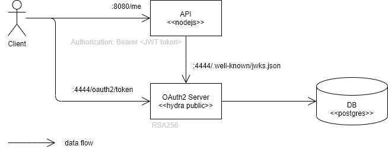

# OAuth2 Playground

Tools: nodejs, hydra v1.10.2, oathkeeper v0.38.11-beta.1

## Setup Hydra

```sh
export HYDRA_ADMIN_URL=http://localhost:4445
export DSN=postgres://postgres:@localhost:5432/hydra?sslmode=disable

hydra migrate sql -y $DSN
```

Generate password.

```sh
export SECRETS_SYSTEM=$(cat /dev/urandom | tr -dc 'a-zA-Z0-9' | fold -w 32 | head -n 1)
echo $SECRETS_SYSTEM
```

Start admin server.

```sh
hydra serve admin --dangerous-force-http
```

### Setup Client Credentials Flow

```sh
export HYDRA_ADMIN_URL=http://localhost:4445
export CLIENT_SECRET=change-me-now

# https://www.ory.sh/hydra/docs/next/cli/hydra-clients-create
hydra clients create --id my-client --secret $CLIENT_SECRET \
  -g client_credentials --token-endpoint-auth-method client_secret_post \
  --audience abc,xyz --scope read,write
```

## Scenario #1: JWT token



Start Hydra.

```sh
# see: export DSN=...
hydra serve public --dangerous-force-http -c jwt/hydra.yaml
```

Start API.

```sh
node jwt/api.js
```

Start Client.

```sh
# see: export CLIENT_SECRET=...
node jwt/client.js
```

## Links

- ORY [Hydra](https://www.ory.sh/hydra/docs/), [Oathkeeper](https://www.ory.sh/oathkeeper/docs/).
