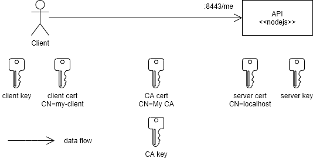

# Auth Playground

Tools: openssl, nodejs, hydra v1.10.2, oathkeeper v0.38.11-beta.1

## Setup Hydra

```sh
export HYDRA_ADMIN_URL=http://localhost:4445
export DSN=postgres://postgres:@localhost:5432/hydra?sslmode=disable

hydra migrate sql -y $DSN
```

Generate password.

```sh
export SECRETS_SYSTEM=$(cat /dev/urandom | tr -dc 'a-zA-Z0-9' | fold -w 32 | head -n 1)
echo $SECRETS_SYSTEM
```

Start admin server.

```sh
hydra serve admin --dangerous-force-http
```

### Setup Client Credentials Flow

```sh
export HYDRA_ADMIN_URL=http://localhost:4445
export CLIENT_SECRET=change-me-now

# https://www.ory.sh/hydra/docs/next/cli/hydra-clients-create
hydra clients create --id my-client --secret $CLIENT_SECRET \
  -g client_credentials --token-endpoint-auth-method client_secret_post \
  --audience abc,xyz --scope read,write
```

## Scenario #1: JWT token


Start Hydra.

```sh
# see: export DSN=...
hydra serve public --dangerous-force-http -c jwt/hydra.yaml
```

Start API.

```sh
node jwt/api.js
```

Start Client.

```sh
# see: export CLIENT_SECRET=...
node jwt/client.js
```

## Scenario #2: opaque token


Start Hydra.

```sh
# see: export DSN=...
hydra serve all --dangerous-force-http -c opaque/hydra.yaml
```

Start Oathkeeper.

```sh
oathkeeper serve -c opaque/oathkeeper.yml
```

Start API.

```sh
node opaque/api.js
```

Start Client.

```sh
# see: export CLIENT_SECRET=...
node opaque/client.js
```

## Scenario# 3: keypair token


This scenario is very similar to #1 above, except it uses a *signed JWT token* to request *access key*.

Generate JWK key and copy content of the private key into file `keypair/key.json` (this file is read by the client application).

```sh
node keypairs/gen-key.js
```

```sh
hydra serve admin --dangerous-force-http
```

> Note, at the time of this writing, Hydra CLI does not support `jwks` parameter.

Issue the following HTTP request.

```sh
POST /clients HTTP/1.1
Host: localhost:4445
Content-Type: application/json

{
    "client_id": "client-2",
    "grant_types": [
        "client_credentials"
    ],
    "scope": "read write",
    "audience": [
        "abc",
        "xyz"
    ],
    "jwks": {
        "keys": [
            {
                "use": "sig",
                "kty": "RSA",
                "kid": "xc4d2XSeF_iYDUCIdzsCujenHC6Gh6r_nwoZAhfplxM",
                "alg": "RS256",
                "n": "2gveXesJbXIPl1wclt1bhHf7zasb5TNEymtBKJZnAmZfeNGO-jcaRphAmRZQo33jYpl3Ww5KiEEvEzgoDuX72SXVOFKWUed90LdUAmeJbu7By6vHRo7eaRZ4hWA9dpqh5YRj4ZpKH7Hhvcik-aquZhW-SONOIPk54aRkJwOt1XJgUnHdM4Lp-1s-aEDn4KEpeXfSI1UP0txgRv8hcW4-KZDMXX4AuVdszKGj_4jX4p2YvuhGNBkRKs0Uw6vaYVTvYWBLKie87msu9qrwwsVG0SvxMx0ceJU2PspzIL9uT1COlIFANVIYJJBo41npFWpKVyocAdOe3wC2DoShxsINww",
                "e": "AQAB"
            }
        ]
    },
    "token_endpoint_auth_method": "private_key_jwt"
}
```

Start Hydra.

```sh
# see: export DSN=...
hydra serve public --dangerous-force-http -c jwt/hydra.yaml
```

Start API.

```sh
node jwt/api.js
```

Start Client.

```sh
node keypairs/client.js
```

## Scenario# 4:  mTLS



Generate a certificate authority (CA), client and server keys.

> The CA is a private key (ca.key) and public key (wrapped up in a self-signed X.509 certificate) in the PEM format.

```sh
sh mtls/keys/gen-keys.sh
```

Start API.

```sh
node mtls/api.js
```

Start Client.

```sh
node mtls/client.js
```

## Appendix

### JWT Token Sample

```json
{
  "aud": [
    "abc",
    "xyz"
  ],
  "exp": 1622988104,
  "iat": 1622988044,
  "iss": "http://localhost:4444/",
  "jti": "cb3f2165-a0cf-48df-9d8c-8656307856c5",
  "nbf": 1622988044,
  "scp": "read write",
  "sub": "my-client"
}
```

### HTTP

Access Token

```http
POST /oauth2/token HTTP/1.1
Host: localhost:4444
Content-Type: application/x-www-form-urlencoded
Content-Length: 115

grant_type=client_credentials&client_id=my-client&client_secret=change-me-now&scope=read%20write&audience=abc%20xyz
```

### Jaeger

```sh
export TRACING_PROVIDER=jaeger
export TRACING_PROVIDERS_JAEGER_LOCAL_AGENT_ADDRESS=localhost:6831
```

## Links

- ORY [Hydra](https://www.ory.sh/hydra/docs/), [Oathkeeper](https://www.ory.sh/oathkeeper/docs/).
- openssl [req](https://www.openssl.org/docs/man1.1.1/man1/openssl-req.html), [genrsa](https://www.openssl.org/docs/man1.1.1/man1/openssl-genrsa.html), [x509](https://www.openssl.org/docs/man1.1.1/man1/openssl-x509.html).
